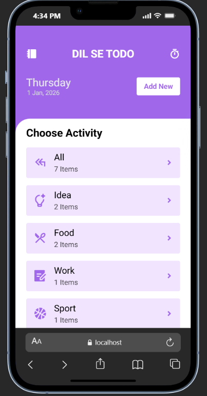
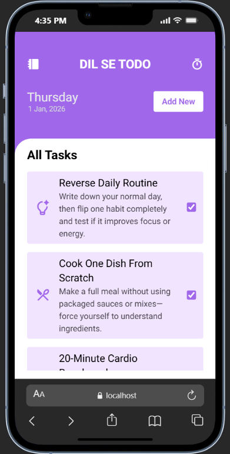

# Advanced Todo App (React + TailwindCSS)

> A modern, polished Todo application built with **React**, styled with **TailwindCSS**, and deployed on **Netlify**.

- Live Demo: [https://react10todo.netlify.app/](https://react10todo.netlify.app/)
- Repo: [https://github.com/Dileep-kumawat/Advanced-Todo-app-using-React-and-tailwindcss](https://github.com/Dileep-kumawat/Advanced-Todo-app-using-React-and-tailwindcss)

---

## 📺 Demo

Click below to watch the routing in action!

<video width="720" controls>
  <source src="./demo.mp4" type="video/mp4" />
  Your browser does not support the video tag.
</video>

[click here to watch on youtube](https://youtu.be/GNn5vFNgao8)

---

## 🚀 Overview

This isn’t any average “React Todo.” I implemented a more advanced structure with state management, component modularity, and utility-first CSS. 
The goal here is simple: track tasks efficiently, with a clean UI and responsive design.

---

## 🧠 Key Features

✔ Add, edit, and delete Todo items
✔ Mark tasks as complete / incomplete
✔ Filter tasks by status (All / Idea / Food / Work / ...)
✔ Responsive layout out of the box
✔ Component-driven architecture
✔ Implemented LocalStorage for persists data even after refresh

---

## 📁 Screenshots

<div style="display:flex;width:100%;justify-content:center;align-items:center;gap:10%;">
    
    
</div>

---

## 🛠 Tech Stack

* **React** - UI components and state
* **TailwindCSS** - utility-first styling
* **Netlify** - deployment hosting
* **localStorage** — persistence

---

## 🏁 Getting Started

Clone the project:

```bash
git clone https://github.com/Dileep-kumawat/Advanced-Todo-app-using-React-and-tailwindcss.git
cd Advanced-Todo-app-using-React-and-tailwindcss
```

Install dependencies:

```bash
npm install
```

Start dev server:

```bash
npm start
```

Build for production:

```bash
npm run build
```

---

## 📦 Folder Structure

```
src/
├── components/       # UI components
|── contexts /        # For managing context api
├── styles/           # Tailwind config + base styles
├── App.jsx
├── index.jsx
```

---

## 💡 How It Works

State is managed at the top level (`App.jsx`) and passed down via props. Todo items are stored in an array of objects. Tailwind utility classes handle all styling, keeping CSS minimal and scoped.

---

## 🙌 Author

**Dileep kumawat**

- 📧 [dileepkumawat525@gmail.com](mailto:dileepkumawat525@gmail.com)
- 🔗 [LinkedIn](https://www.linkedin.com/in/dileep-kumawat/)

---

## 📜 License

MIT © Dileep Kumawat